# SO:LO (SNS 개인 프로젝트)

## 🎯 프로젝트 주제
react를 활용한 마케팅 요소가 추가된 SNS 사이트 만들기

---

## 📝 프로젝트 소개

### SO:LO

> **Social + Lone**  
> **SOCIAL FOR LONE MOMENTS**  
> *혼자인 시간을 위한 소셜 플랫폼*  

SO:LO는 혼밥, 혼술, 혼카페, 혼행 등 혼자만의 활동을 기록하고 공유할 수 있는 SNS 서비스입니다.  
사용자는 자신의 경험과 장소 정보를 공유하고, 비슷한 관심사를 가진 사람들과 소통할 수 있습니다.  

---

## 📅 개발 기간
### 2026.05.27 ~ 2026.06.08 (약 52시간)
<table>
  <tr>
    <th>개발 기간</th>
    <th>기간별 업무</th>
  </tr>
  <tr>
    <td>05.27 ~ 05.28(2일)</td>
    <td>기획 및 설계</td>
  </tr>
  <tr>
    <td>05.29 ~ 06.07(6일)</td>
    <td>기능 개발 </td>
  </tr>
  <tr>
    <td>06.08 ~ 06.08(1일)</td>
    <td>테스트 및 오류 수정</td>
  </tr>
</table>

---

## 🛠 사용 기술

<table>
  <tr>
    <th>분류</th>
    <th>기술</th>
  </tr>

  <tr>
    <td><b>Frontend</b></td>
    <td>
      
      
    </td>
  </tr>

  <tr>
    <td><b>Backend</b></td>
    <td>
      
      
      
    </td>
  </tr>

  <tr>
    <td><b>Database</b></td>
    <td>
      
    </td>
  </tr>

  <tr>
    <td><b>API</b></td>
    <td>
      
      
    </td>
  </tr>
</table>

---

## 📐 기획 및 설계
- [프로젝트 기획 및 설계](./readme-file/solo-project-planning.pdf)
- [DB 설계 및 기능](./readme-file/solo-db-design.xlsx)
- [ERD](./readme-file/ERD.png)

---

## 🎥 시연 영상 및 발표 자료
- [SO:LO PPT](https://drive.google.com/file/d/1_rSN6P8Fase_j4ueutch95y4M1LoOQsU/view?usp=sharing) 
- [SO:LO 시연 영상](https://drive.google.com/file/d/1D2upwWbMRRLQ4LRFXBHgeFVib80ATJvE/view?usp=drive_link)

---

## ✨ 주요 기능
**1. 로그인/회원가입**  

- 회원가입, 로그인, 아이디 및 비밀번호 찾기 기능 구현
- Solapi SMS API를 활용한 휴대폰 인증
- 인증번호 검증을 통한 본인 확인
- 비밀번호는 bcrypt를 활용하여 암호화 후 저장

<table>
  <tr>
    <th>로그인</th>
    <th>회원가입</th>
  </tr>
  <tr>
    <th>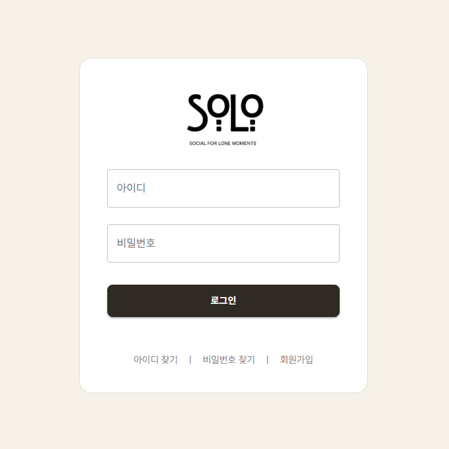</th>
    <th>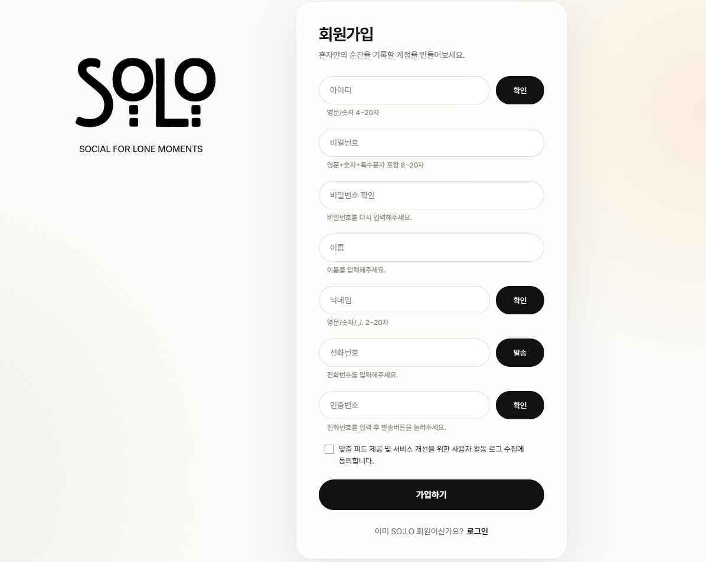</th>
  </tr>
</table>

---

**2. 메인 피드 페이지**  

- 좌측 메뉴바 (홈, 검색, 프로필, 기록하기, 알림, 메시지, 설정, 로그아웃)
- 상단 카테고리별 현황 제공 (나만 혼자인 것이 아니라는 작은 공감을 전하기 위해 사용자들의 오늘 활동 현황을 시각화)
- JWT 인증 정보를 기반으로 현재 로그인한 사용자를 확인하고, 사용자 관심사 및 활동 이력에 맞는 피드 제공

---

**3. 상세보기**  

- 이미지/영상 슬라이드 및 방문한 장소 정보 확인
- 댓글/대댓글 작성 및 좋아요 기능
- 작성자가 등록한 태그 확인
- 장소 찜 및 폴더별 저장 기능
- 내가 작성한 기록 수정 및 삭제

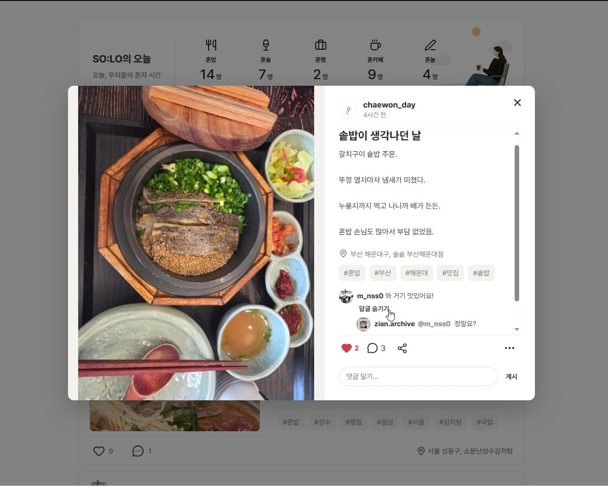
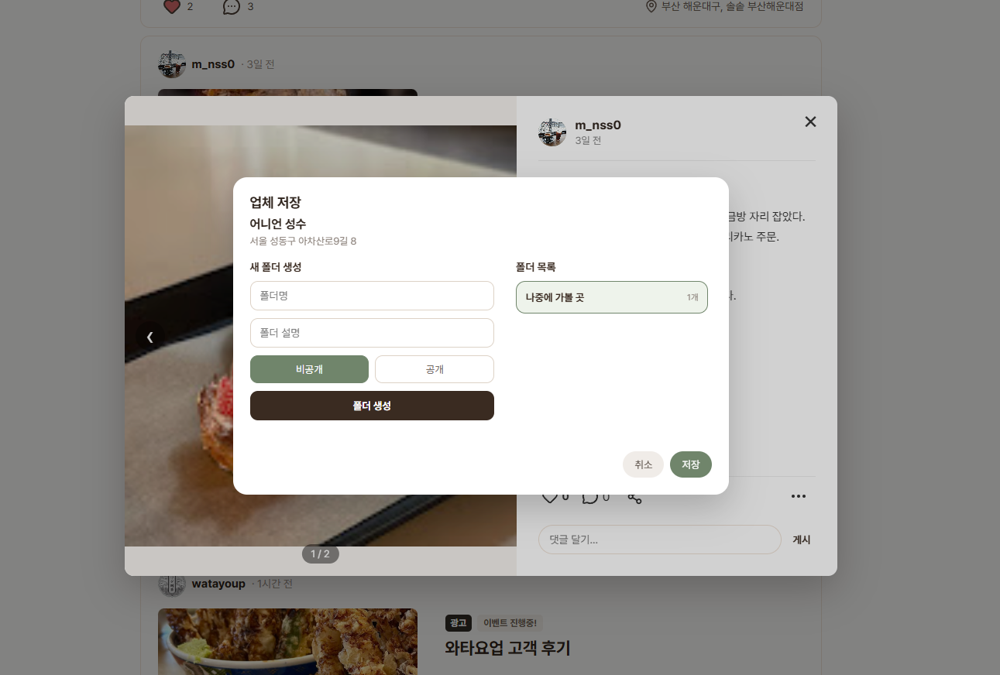

---

**4. 기록하기**  

- 카카오맵 API 기반 장소 검색 및 등록
- 카테고리별 기록 작성
- 이미지·영상 첨부 기능
- 태그 등록 및 댓글 허용 여부 설정

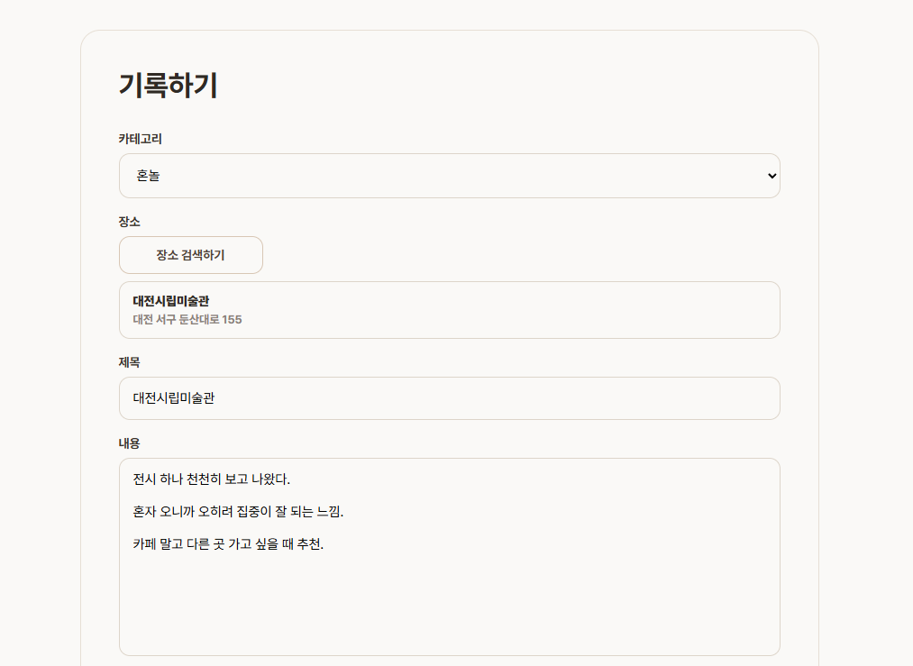
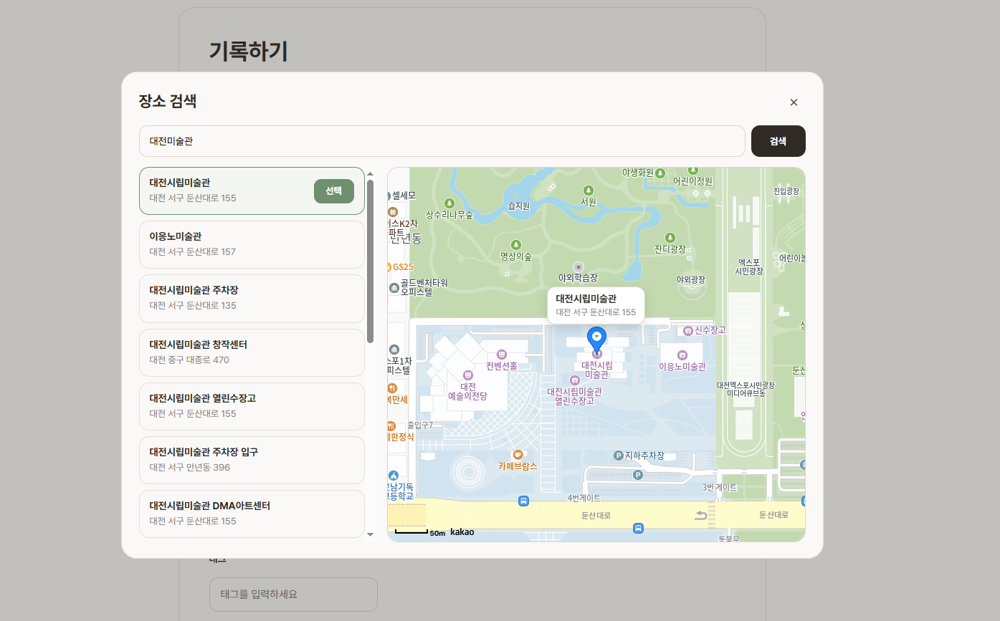
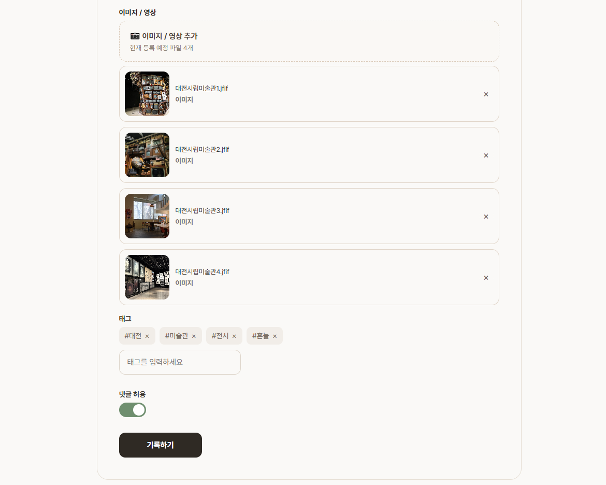

---

**5. 프로필**  

- 프로필 정보 및 소통 스타일 뱃지 확인
- 작성한 기록 및 찜한 업체 관리
- 팔로우 및 메시지 신청
- 사용자 차단 및 신고 기능

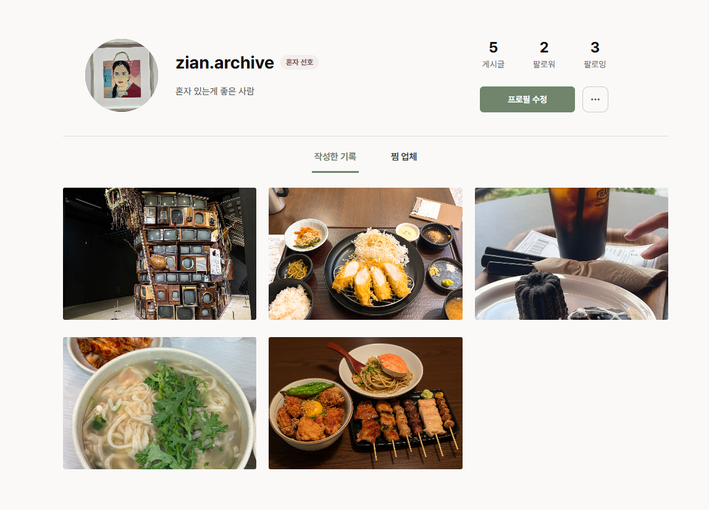  

---

**6. 메시지**  

- Socket.IO를 활용하여 사용자 간 1:1 실시간 메시지 기능을 구현
- 읽지 않은 메시지 확인 기능
- 채팅방 목록 및 최근 메시지 표시
- 메시지 알림 및 채팅방 이동 기능
   
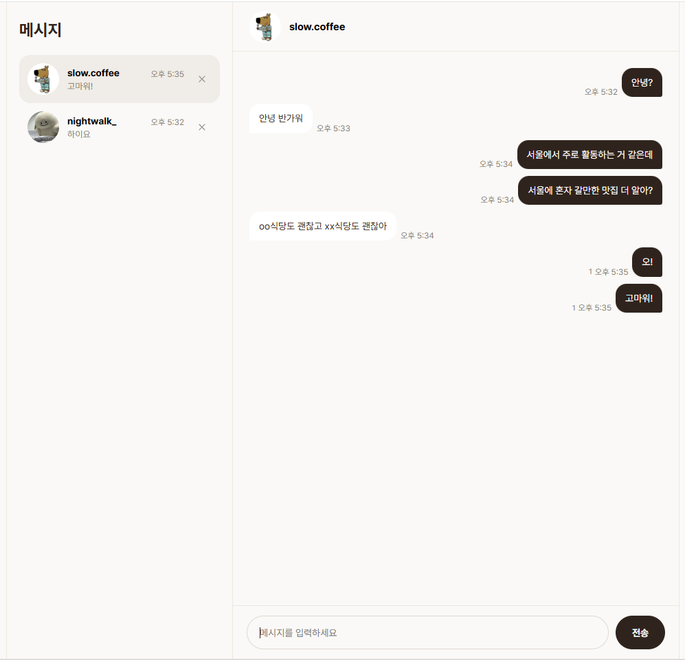  

---

**7. 검색**  

- 사용자 및 기록 통합 검색
- 태그, 제목, 장소 기반 검색
- 검색 결과 썸네일 미리보기 제공
- 사용자 프로필 및 기록 상세 페이지 이동

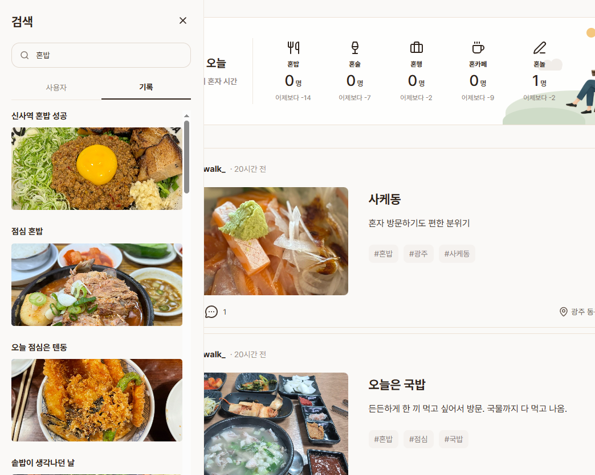  
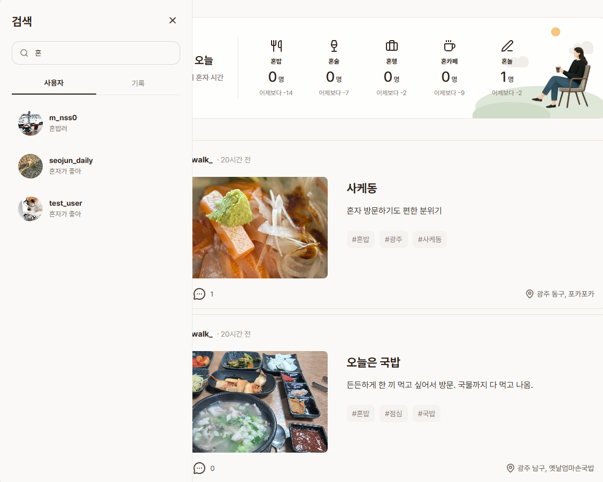  

---

**8. 알림**  

- 댓글, 대댓글, 좋아요 알림 제공
- 팔로우 요청 및 승인 알림 제공
- 메시지 수신 알림 제공
- 알림 클릭 시 해당 화면으로 이동
   
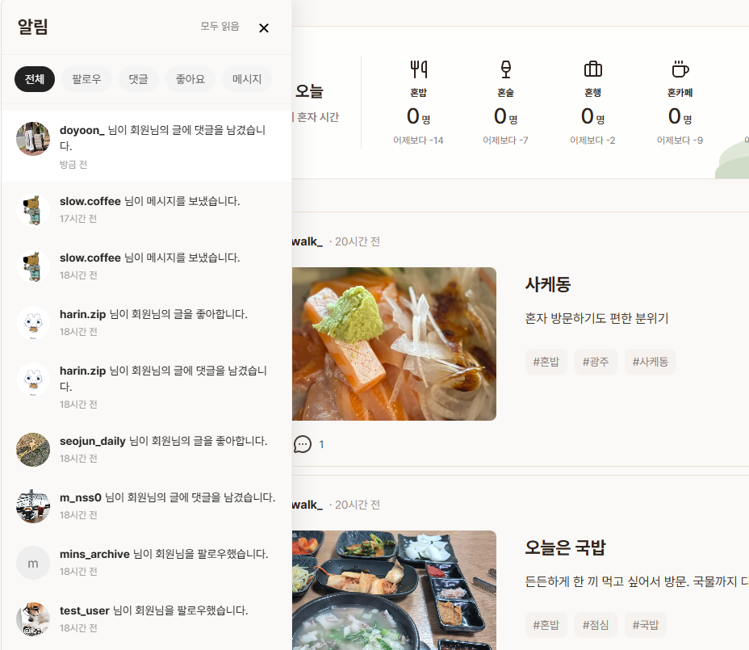

---

**9. 광고**  

- 비즈니스 계정만 광고글 작성 가능
- 광고 태그를 활용한 이벤트 및 프로모션 홍보
- 외부 링크를 통한 예약·주문·홈페이지 연결
- 일반 게시글과 구분된 광고 콘텐츠 제공

---

## 💬 프로젝트 소감

- 처음 기획할 때 내가 사용하고 싶은 SNS를 만들자고 생각했고, 직접 만들어 볼 수 있어서 재미있었습니다.
- 휴대폰 인증번호 전송과 카카오맵 API 연동 등 이전 팀 프로젝트에서는 해보지 못한 기능을 구현해 볼 수 있었습니다.
- 기능이 늘어날수록 코드가 복잡해져 구조를 더 잘 정리했으면 좋겠다는 아쉬움이 남았습니다.
- 기간이 더 주어진다면 AI 추천 기능과 현재 UI만 구현된 공유 기능을 완성해 보고 싶습니다.
