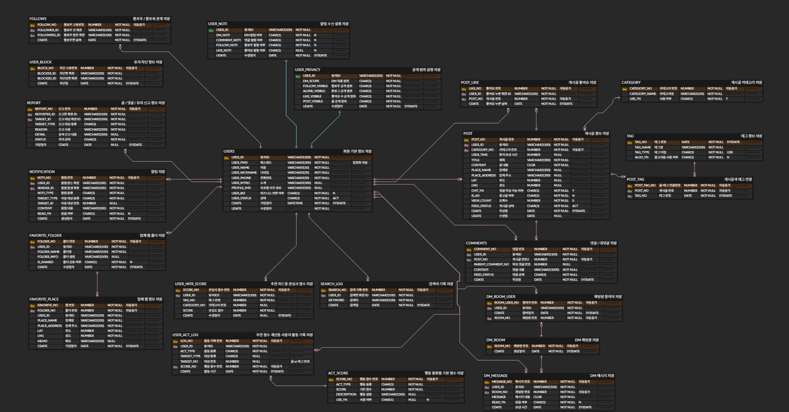

# SO:LO SNS

## 📌프로젝트 주제
react를 활용한 마케팅 요소가 추가된 SNS 사이트 만들기

---

## 📌프로젝트 소개
SO:LO는 혼밥, 혼술, 혼카페, 혼행 등 혼자만의 활동을 기록하고 공유할 수 있는 SNS 서비스입니다.  
사용자 간 소통과 장소 정보 공유를 통해 1인 활동 문화를 위한 커뮤니티를 제공합니다.  

---

## 📌개발 기간
2026.05.28 ~ 2026.06.08 ( 약 8일간 )

---

## 🛠 사용 기술

<table>
  <tr>
    <th>분류</th>
    <th>기술</th>
  </tr>

  <tr>
    <td><b>Frontend</b></td>
    <td>
      
    </td>
  </tr>

  <tr>
    <td><b>Backend</b></td>
    <td>
      
      
    </td>
  </tr>

  <tr>
    <td><b>Database</b></td>
    <td>
      
    </td>
  </tr>
</table>

---

## 📌기획 및 설계
- [프로젝트 기획 및 설계](./readme-file/solo-project-planning.pdf)
- [DB 설계 및 기능](./readme-file/solo-db-design.xlsx)

---

## 📌주요 기능
1. 로그인/회원가입
   

---
