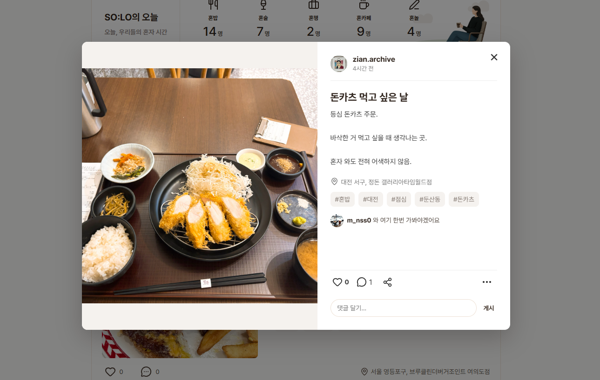

# SO:LO (SNS 개인 프로젝트)

## 📌프로젝트 주제
react를 활용한 마케팅 요소가 추가된 SNS 사이트 만들기

---

## 📌프로젝트 소개
SO:LO는 혼밥, 혼술, 혼카페, 혼행 등 혼자만의 활동을 기록하고 공유할 수 있는 SNS 서비스입니다.  
사용자 간 소통과 장소 정보 공유를 통해 1인 활동 문화를 위한 커뮤니티를 제공합니다.  

---

## 📌개발 기간
2026.05.28 ~ 2026.06.08 ( 약 8일간 )

---

## 🛠 사용 기술

<table>
  <tr>
    <th>분류</th>
    <th>기술</th>
  </tr>

  <tr>
    <td><b>Frontend</b></td>
    <td>
      
    </td>
  </tr>

  <tr>
    <td><b>Backend</b></td>
    <td>
      
      
    </td>
  </tr>

  <tr>
    <td><b>Database</b></td>
    <td>
      
    </td>
  </tr>
</table>

---

## 📌기획 및 설계
- [프로젝트 기획 및 설계](./readme-file/solo-project-planning.pdf)
- [DB 설계 및 기능](./readme-file/solo-db-design.xlsx)
- [ERD](./readme-file/ERD.png)

---

## 📌주요 기능
**1. 로그인/회원가입**  
<table>
  <tr>
    <th>로그인</th>
    <th>회원가입</th>
  </tr>
  <tr>
    <th></th>
    <th></th>
  </tr>
</table>

- 회원가입 후 로그인 가능
- 전화번호로 전송된 인증번호 입력
- 비밀번호는 bcrypt로 암호화해서 저장

---

**2. 메인 피드 페이지**  

- 좌측 메뉴바 (홈, 검색, 프로필, 기록하기, 알림, 메시지, 설정, 로그아웃)
- 상단 카테고리별 현황 (나만 혼자인 것이 아니라는 작은 공감을 전하기 위해 사용자들의 오늘 활동 현황을 시각화)
- 관심사 및 활동 이력을 반영한 피드 추천 리스트

---

**3. 상세보기**  

- 이미지/영상 슬라이드, 방문한 장소 표시
- 좋아요/댓글 기능
- 작성자가 등록한 태그
- 내가 작성한 기록 수정 및 삭제

---

**4. 댓글 및 좋아요**  

---

**5. 기록하기**  

---

**6. 프로필**  
   

---

**7. 메시지**  
   

---

**8. 검색**  

---

**9. 알림**  
   

---

**10. 광고**  

---

